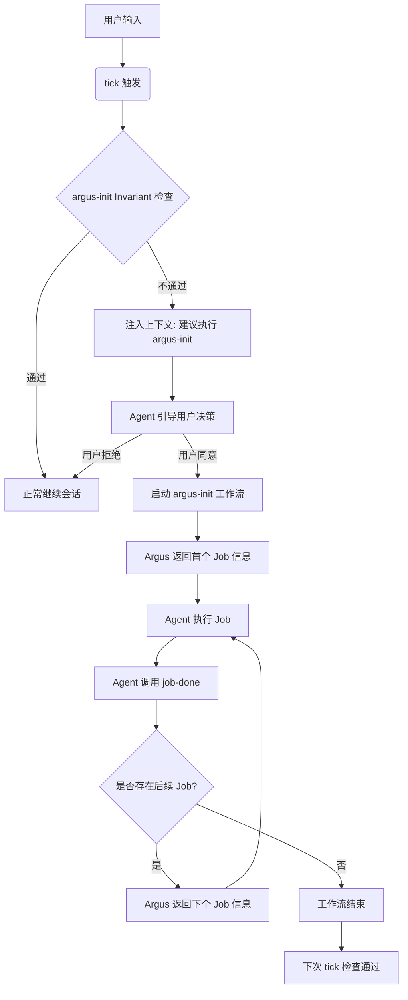

# Invariant 系统技术设计

## 4.1 概念与设计理念

### 起源：从布尔标记到声明式状态检查

在 Argus 的早期设计中，曾考虑使用 `initialized: true` 这样的布尔标记来判断项目是否完成初始化。但这种方式存在局限性。布尔标记只能说明任务曾经执行过，无法反映项目的当前真实状态。如果用户手动删除了某些初始化产物，或者 Argus 升级后对初始化有了新要求，布尔标记将失效。

因此，Argus 转向了以产物为唯一标准的声明式状态检查。系统不再记录是否执行过某个动作，而是持续检查项目当前是否满足预期的状态要求。这种思路泛化后形成了 Invariant（不变量）系统。

### 核心定义

Invariant 是指项目应该始终满足的条件。无论项目经历了何种操作，这些条件在逻辑上都应当保持为真。当系统检测到这些条件不满足时，会触发相应的纠偏流程。

### Shell Only：确定性与静默执行

Invariant 检查仅支持 Shell 类型（Bash 命令加退出码），不支持 Prompt 检查（即通过 AI Agent 进行语义评估）。这种设计的考量如下：

1. **静默执行**：Shell 检查可以在后台快速运行。当所有检查通过时，系统可以静默跳过，不干扰用户的正常工作流。
2. **避免二次中断**：如果使用 Prompt 检查，失败后仍需启动 Workflow 进行修复。这意味着用户会被中断两次（先是检查中断，后是修复中断）。
3. **深度验证后置**：对于需要语义理解的复杂验证，应将其放置在修复工作流（Remediation Workflow）的第一个任务中。将发现问题与深度判断合二为一，使流程更顺畅。

### 语义检查转化为时效性检查

对于无法通过简单 Shell 命令判断的语义正确性（例如文档与代码的一致性），Argus 采用时效性检查作为替代。系统不直接检查语义，而是检查相关的审查工作流是否在规定时间内执行过。

| 直接检查 | 时效性检查 |
|---------|----------|
| 检查 AGENTS.md 与代码是否一致（需 AI 语义理解） | 检查 7 天内是否运行过 agents-md-review 工作流（仅需检查时间戳） |
| 不确定，速度慢，依赖模型能力 | 确定，速度快，纯 Shell 执行 |

### 与声明式系统的对比

Argus 的 Invariant 系统参考了成熟的声明式配置管理工具，但在调和机制上有所不同。

| 系统 | 期望状态描述 | 单个项目 | 调和动作 |
|------|-----------|---------|---------|
| Kubernetes | Manifest | Resource | Reconcile |
| Terraform | Configuration | Resource | Plan / Apply |
| Ansible | Playbook | Task | Converge |
| OPA | Policy | Rule | Evaluate |
| Puppet | Manifest | Resource | Enforce |

关键区别在于：传统的自动化工具通常内置了如何达到目标状态的逻辑，而 Argus 不直接处理修复逻辑。Argus 负责发现偏离，而由 AI Agent 通过执行关联的工作流来完成修复。

### 命名理由

选择 Invariant 而非 Check 或 Guard，是因为该词能精确表达"应当始终为真"的数学语义，并能有效区分于 Argus 中的 Rule（Agent 规则）或 Policy（策略管控）。它强调的是状态的一致性与不可变性。

## 4.2 Invariant 与 Workflow 的关系

### 互补范式

Workflow 与 Invariant 分别代表了过程式与声明式两种互补的范式。

| 特性 | Workflow | Invariant |
|---|---|---|
| 范式 | 过程性（Imperative）：描述如何做 | 声明式（Declarative）：描述应是什么样 |
| 职责 | 回答 How：按什么步骤执行 | 回答 What：满足什么条件 |
| 作用时机 | 主动执行或按序推进时 | 状态发生偏离时 |
| 应对风险 | 解决 Agent 不知道操作路径的问题 | 解决操作结果不完美或非 Agent 修改导致的状态偏离 |

### 协作模式

Workflow 是正向引导，Invariant 是偏离纠正。即使 Workflow 执行过程中出现偏差，或者用户在 Argus 之外直接修改了代码，Invariant 也能捕获到异常并指向修复路径。

其协作逻辑如下：
1. Invariant 定义期望状态。
2. Check 失败，检测到偏离。
3. 触发关联的修复工作流。
4. Agent 按步骤执行修复任务。
5. 任务完成后，Invariant 重新得到满足。

## 4.3 YAML Schema 规范

### 字段定义

| 字段 | 必填 | 说明 |
|------|------|------|
| version | 是 | Schema 版本，当前为 v0.1.0。 |
| id | 是 | 唯一标识符。命名规则：`^[a-z0-9]+(-[a-z0-9]+)*$`；`argus-` 前缀保留给内置系统，用户不可使用。 |
| description | 否 | 人类可读的描述信息。 |
| auto | 否 | 自动检查的时机。可选值为 always, session_start, never（默认）。 |
| check | 是 | Shell 检查列表（至少包含 1 个 step）。按顺序执行，任一步骤失败即停止（短路原则）。 |
| check[].shell | 是 | Bash 命令。每个步骤在独立的进程中执行，退出码 0 表示通过。 |
| check[].description | 否 | 该步骤的描述，用于报告展示。 |
| prompt | 否 | 检查失败时注入给 Agent 的引导文本。 |
| workflow | 否 | 检查失败时建议关联的修复工作流 ID。 |

注意：`prompt` 与 `workflow` 字段不可同时为空。两者可以共存——检查失败时，Argus 会同时注入 `prompt` 引导文本并追加 `workflow` 建议。

### 多行 Shell 与步骤隔离

每个 check step 在独立的进程中执行，但同一个 step 内的多行 Shell 共享执行上下文（工作目录、变量等）。如需在单步内进行多项关联检查，可使用多行写法：

```yaml
check:
  - shell: |
      cd .argus/rules
      test -f security.yaml
      test -f coding-style.yaml
    description: "Rule files are complete"
```

### YAML 示例

#### 内置初始化检查（argus-init）（简略示例，规范定义见 §4.8）

```yaml
version: v0.1.0
id: argus-init
description: "项目已完成 Argus 初始化"
auto: always

check:
  - shell: "test -d .argus/rules"
    description: "Rules 目录存在"
  - shell: "test -f .agents/skills/argus-doctor/SKILL.md && test -f .claude/skills/argus-doctor/SKILL.md"
    description: "Skills 已生成（含 Claude Code 项目级镜像）"

workflow: argus-init
```

#### Lint 时效性检查（lint-clean）

```yaml
version: v0.1.0
id: lint-clean
description: "代码应通过 lint 检查"
auto: session_start

check:
  - shell: "find .argus/data/lint-passed -mtime -1 | grep -q ."
    description: "24 小时内 lint 检查通过"

prompt: "Lint 检查可能已过期，请确认代码是否仍然通过 lint"
workflow: run-lint
```

#### 配置文件完整性检查（gitignore-complete）

```yaml
version: v0.1.0
id: gitignore-complete
description: ".gitignore 应包含 Argus 临时文件"
auto: session_start

check:
  - shell: "grep -q '.argus/logs' .gitignore"
    description: ".gitignore 包含 .argus/logs"

prompt: "请在 .gitignore 中添加 .argus/logs/"
```

#### 手动触发的时效性检查（agents-md-fresh）

```yaml
# auto: never + workflow-only (manual trigger only)
version: v0.1.0
id: agents-md-fresh
description: "AGENTS.md should stay up to date"
auto: never

check:
  - shell: "find AGENTS.md -mtime -7 | grep -q ."
    description: "AGENTS.md updated within 7 days"

workflow: update-agents-md
```

## 4.4 执行模型

### 自动检查机制

在 Agent 每次与用户交互产生的 tick 过程中，Argus 会根据 auto 字段的配置执行自动检查。

- **always**：每次 tick 均检查。
- **session_start**：仅在每个会话的首个 tick 检查一次。
- **never**：不进行自动检查。

为了保证响应速度，自动检查应尽量保持快速。单个 check step 的超时上限为 5 秒，总耗时超过 2 秒时会提示用户排查。

### Shell Check 执行环境

每个 check step 在独立的 Bash 进程中执行，执行环境规范如下：

| 配置项 | 规定 |
|--------|------|
| 调用方式 | `/usr/bin/env bash -c "<script>"` |
| Shell 模式 | Non-login、non-interactive（不加 `-l` / `-i` 参数） |
| Profile 加载 | **不加载**用户 profile（`~/.bashrc`、`~/.bash_profile` 等均不 source） |
| Shell 选项 | **不隐式启用** `set -e`、`set -o pipefail` 等。检查脚本作者自行控制错误处理 |
| 工作目录 (cwd) | 项目根目录（`.argus/` 所在目录） |
| 环境变量 | 继承当前进程环境，额外注入 `ARGUS_PROJECT_ROOT`（项目根绝对路径） |
| stdout/stderr | 检查通过时忽略；检查失败时捕获作为诊断信息放入报告 |
| 超时 | 单个 check step 5 秒超时（详见下文"超时与性能监控"小节） |

**设计取舍**：选择 non-login 模式而非 login shell（`bash -l -c`），是为了保证检查结果的**确定性和可预测性**。加载用户 profile 会引入不可控因素：(1) 不同团队成员的 profile 差异导致同一 check 结果不一致；(2) profile 中的 conda/nvm 等初始化增加每个 step 数百毫秒的启动开销，多 step 累积容易触发 2s 总耗时警告；(3) 部分 profile 会向 stdout/stderr 打印信息，干扰 check 的输出捕获。实际场景中，Argus 从 Agent Hook 触发，Agent 进程已继承用户的 shell 环境（含 `PATH`），因此大多数用户工具在 non-login 模式下仍可通过继承的 `PATH` 访问。

### 超时与性能监控

- **单个 check step 超时**：5 秒。超时后 kill 进程，该 step 视为**失败**，报告中标注 `timeout`。
- **整体耗时监控**：argus 记录所有 invariant check 的总执行耗时。若总耗时超过 2 秒，在 tick 输出中追加提示：建议运行 `argus doctor` 排查慢检查项。
- **耗时数据**：每个 check 的执行耗时记录在输出中，可供后续分析和优化。
- **Phase 1 不支持自定义超时**：统一使用默认值，不在 invariant YAML 中添加 `timeout` 字段。

### 检查失败的处理

当自动检查失败时，Argus 不会自动启动修复工作流，而是将失败信息和修复建议作为上下文注入给 Agent。Agent 会负责向用户解释情况并引导用户决策。这体现了人类在环（Human-in-the-loop）的设计原则。

### 检查输出三态

invariant check 的每个 step 输出三态：

- **pass**：检查通过
- **fail**：检查失败（短路，后续 step 标记为 skip）
- **skip**：前序 step 失败，本 step 未执行

仅失败的 invariant 才输出关联的 `workflow` / `prompt` 信息。

### 手动检查

用户可以通过 CLI 命令或斜杠命令主动触发所有不变量的检查，包括那些耗时较长、设为 never 的检查。

### 异步检查（未来方向）

设计方向：tick 触发后台检查，不等待结果；结果缓存，下次 tick 读取缓存；如不满足则注入建议。未决问题：触发时机细化、检查频率控制（冷却机制、去重）。

## 4.5 内置与用户自定义

| 维度 | 内置 Invariant | 用户自定义 Invariant |
|---|---|---|
| 标识符 | 必须以 argus- 为前缀 | 禁止使用 argus- 前缀 |
| 定义位置 | 内嵌于二进制，安装时释出 | 用户在 .argus/invariants/ 创建 |
| 维护方式 | 随 Argus 版本升级自动更新 | 用户自行维护 |
| 自动检查 | 默认开启（通常为 always） | 由用户配置（通常为 session_start 或 never） |

## 4.6 修复工作流缺失的处理

如果 Invariant 引用了一个不存在的工作流：

1. **静态检查阶段**：执行 inspect 或 doctor 命令时会报告交叉引用错误。
2. **运行阶段**：在 tick 过程中，Argus 会正常输出检查失败的详细信息（执行了什么命令、产生了什么错误），并说明关联的修复工作流不存在。此时 Agent 将根据上下文尝试自主修复。

## 4.7 invariant inspect 校验规范

命令格式：`argus invariant inspect [dir] [--markdown]`

校验逻辑包括：
1. YAML 语法正确性。
2. Schema 必填字段校验。
3. 未知键（Unknown Keys）检测。
4. auto 字段的枚举值校验。
5. 跨文件的 ID 重复检查。
6. 命名空间校验（argus- 前缀保留规则）。
7. 工作流引用合法性（引用的工作流必须在 workflows 目录中存在）。传入非默认 `[dir]` 时，workflow 引用始终对当前项目 `.argus/workflows/` 校验——`[dir]` 只改变 invariant 的搜索范围，不改变 workflow 的查找范围。
8. 版本兼容性校验。
9. **ID 格式校验**：Invariant `id` 必须匹配 `^[a-z0-9]+(-[a-z0-9]+)*$`。
10. **check 非空校验**：`check` 列表不可为空，至少包含一个 step。

## 4.8 argus-init 深度解析

### Invariant 定义

```yaml
version: v0.1.0
id: argus-init
description: "项目已完成 Argus 初始化"
auto: always

check:
  - shell: 'test -d .argus/rules && test "$(ls .argus/rules/)"'
    description: "项目规则已生成"
  - shell: "test -f CLAUDE.md || test -f AGENTS.md"
    description: "Agent 原生 rules 文件存在"
  - shell: "test -f .agents/skills/argus-doctor/SKILL.md && test -f .claude/skills/argus-doctor/SKILL.md"
    description: "内置 Skills 已生成（两个项目级路径均存在）"
  - shell: "test -f .git/hooks/pre-commit || test -f .husky/pre-commit || test -f .lefthook.yml || test -f .pre-commit-config.yaml"
    description: "Git pre-commit hook 已配置（支持 .git/hooks、husky、lefthook、pre-commit 框架）"
  - shell: "grep -q '.argus/pipelines' .gitignore && grep -q '.argus/logs' .gitignore && grep -q '.argus/tmp' .gitignore"
    description: ".gitignore 包含 Argus 临时文件（pipelines/、logs/、tmp/）"
  - shell: "test -f .argus/data/init_workflows_generated"
    description: "项目 workflow 已生成（mark 文件）"
  - shell: 'test "$(ls .argus/invariants/*.yaml 2>/dev/null | grep -v argus-)"'
    description: "自定义 invariant 示例已生成"

workflow: argus-init
```

### 修复工作流定义

```yaml
version: v0.1.0
id: argus-init
description: "初始化项目的 Argus 配置"

jobs:
   - id: generate_rules
     skill: argus-generate-rules
     prompt: "分析项目结构，生成技术架构、编码规范、项目领域三方面的规则文件"

   - id: setup_git_hooks
     prompt: "为项目配置 git pre-commit hook，确保提交前自动运行 lint 检查"

   - id: setup_gitignore
      prompt: "确保 .gitignore 包含 .argus/pipelines/、.argus/logs/、.argus/tmp/ 三个 Argus 临时文件路径"

   - id: generate_workflows
     prompt: "根据项目特征生成适合的 workflow 文件到 .argus/workflows/。完成后执行 argus toolbox touch-timestamp .argus/data/init_workflows_generated"

   - id: generate_invariant_examples
     prompt: "生成 1-2 个适合本项目的自定义 invariant 示例到 .argus/invariants/"
```

### 产物核对表

| 产物 | 来源 | Invariant 检查逻辑 |
|------|------|----------------|
| .argus/rules/ 目录 | Agent 分析生成 | 目录存在且非空 |
| CLAUDE.md / AGENTS.md | 根据 rules 写入 | 文件存在 |
| Git Hooks | Agent 配置 | hook 文件或框架配置存在 |
| .gitignore 规则 | Agent 添加 | grep 内容匹配 |
| 项目特定的 Workflows | Agent 生成 | mark 文件 `.argus/data/init_workflows_generated` 存在 |
| 自定义 Invariant 示例 | Agent 生成 | 存在非内置命名的文件 |

### 初始化完整流程



1. 用户输入内容，触发 tick。
2. Argus 检查 argus-init 状态，发现产物缺失，检查失败。
3. Argus 注入上下文：初始化未完成，建议运行 argus-init。
4. Agent 向用户展示状态，询问是否开始初始化。
5. 用户同意后，Agent 启动 argus-init 工作流。
6. Argus 返回第一个任务（generate_rules）的信息。
7. Agent 完成任务并调用 job-done。
8. Argus 直接在 job-done 返回值中下发下一个任务信息。
9. 循环执行直到所有任务完成。
10. 下一次 tick 时，Invariant 检查通过，项目进入正常就绪状态。

## 4.9 CLI 命令概览

### 内部命令

- `argus invariant check`：运行所有不变量检查。
- `argus invariant check <id>`：运行指定的不变量检查。
- `argus invariant list`：列出当前所有已注册的不变量。
- `argus invariant inspect`：执行配置文件的静态校验。

### 斜杠命令

- `/argus-invariant-check`：Agent 调用的统一入口，用于触发完整检查并展示报告。

## 4.10 应用场景

### 系统内置场景

- **环境就绪度检查**：确保必需的目录、规则文件和插件已安装并配置。

### 用户自定义场景

- **代码质量约束**：检查本地 Lint 或单元测试的通过记录是否过期。
- **配置同步验证**：确保 CI/CD 配置文件与当前项目的技术栈保持同步。
- **文档同步**：验证架构图或接口文档是否在近期代码变更后有过更新。
- **依赖安全**：定期检查本地依赖库是否存在已知的安全漏洞。
- **线上错误日志清空**：确认线上错误日志已在发布后被清理或归档，避免旧日志干扰问题排查。
- **告警量级合理**：检查告警数量是否在合理范围内，防止告警风暴或静默遗漏。
