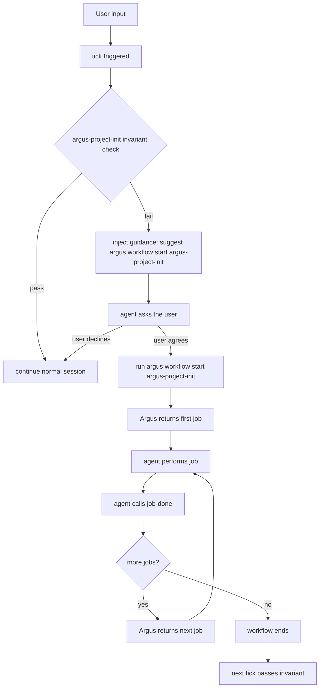

# Invariant System Technical Design

## 4.1 Concepts and Design Philosophy

### From Boolean Markers to Declarative State Checks

Early Argus designs considered a boolean marker such as `initialized: true` to represent initialization status. That approach was rejected because it only says that a task happened once in the past. It cannot prove that the project is still correct now. If a user deletes initialization artifacts later, or a newer Argus version requires additional setup, the boolean marker becomes stale.

Argus therefore moved to declarative checks based on real artifacts. The system no longer records that an action occurred; it continuously checks whether the project currently satisfies the expected state. This generalized into the invariant system.

### Core Definition

An invariant is a condition that should always hold for the project. No matter what operations have happened, the condition is expected to remain true. When Argus detects that the condition is no longer true, it surfaces remediation guidance.

### Shell Only: Determinism and Silent Execution

Invariant checks support only shell steps (bash commands plus exit codes). Prompt-based checks, meaning LLM-evaluated semantic checks, are intentionally excluded.

Reasons:

1. **Silent execution**: shell checks can run quickly in the background and stay invisible when everything passes
2. **Avoid double interruption**: if the check itself used an LLM and then still required a workflow for repair, users would be interrupted twice
3. **Move deep validation into remediation**: if semantic understanding is required, place that logic in the first job of the remediation workflow rather than in the invariant check itself

### Semantic Checks Become Freshness Checks

When correctness cannot be determined cheaply through shell commands, Argus prefers freshness checks.

| Direct semantic check | Freshness-based substitute |
|------|-----------------------------|
| Check whether `AGENTS.md` matches the codebase semantically | Check whether an `agents-md-review` workflow ran within the last 7 days |
| Slow, model-dependent, uncertain | Fast, deterministic, shell-only |

### Comparison to Other Declarative Systems

Argus borrows from mature declarative systems while keeping remediation agent-driven rather than built into the engine.

| System | Desired-state description | Project unit | Convergence action |
|------|----------------------------|--------------|--------------------|
| Kubernetes | Manifest | Resource | Reconcile |
| Terraform | Configuration | Resource | Plan / Apply |
| Ansible | Playbook | Task | Converge |
| OPA | Policy | Rule | Evaluate |
| Puppet | Manifest | Resource | Enforce |

Traditional automation systems often include built-in convergence logic. Argus does not. Argus detects drift, and the AI agent repairs it by running a remediation workflow.

### Why the Term “Invariant”

`Invariant` was chosen instead of `check` or `guard` because it expresses the mathematical idea of “a condition that should remain true.” It also avoids confusion with Argus rules, agent rules, and policy systems.

## 4.2 Invariant and Workflow

### Complementary Paradigms

| Property | Workflow | Invariant |
|---|---|---|
| Paradigm | Imperative: describes how to act | Declarative: describes what should be true |
| Responsibility | Answers **how** | Answers **what** |
| When it matters | During guided execution | When drift appears |
| Main risk addressed | The agent does not know the path | Results drift or non-agent changes break expected state |

### Collaboration Pattern

Workflow provides forward guidance. Invariant provides drift correction. Even if a workflow was executed imperfectly, or the user changed files outside Argus, invariants can still detect the divergence and point back to a remediation path.

Typical collaboration loop:

1. The invariant defines the desired state
2. A check fails
3. Argus suggests remediation
4. The agent executes the remediation workflow
5. The invariant passes again

## 4.3 YAML Schema

### Fields

| Field | Required | Meaning |
|------|----------|---------|
| `version` | Yes | Schema version, currently `v0.1.0` |
| `id` | Yes | Unique identifier. Must match `^[a-z0-9]+(-[a-z0-9]+)*$`. The `argus-` prefix is reserved |
| `order` | Yes | Global runtime order for valid invariants in the current scope. Must be a positive integer, unique within the scope, and lower numbers run first |
| `description` | No | Human-readable description |
| `auto` | No | Automatic execution mode: `always`, `session_start`, or `never` (default) |
| `check` | Yes | List of shell steps; must contain at least one step |
| `check[].shell` | Yes | Bash command. Exit code 0 means pass |
| `check[].description` | No | Per-step description used in reporting |
| `prompt` | No | Guidance text injected on failure |
| `workflow` | No | Suggested remediation workflow ID |

`prompt` and `workflow` may not both be empty. They may coexist, in which case `tick` injects both a `Prompt:` line and a `Workflow:` action line.

Invariant file names are also part of the contract: each file must be named `<invariant-id>.yaml`.

### Multi-Line Shell and Step Isolation

Each check step runs in its own process, but a multi-line `shell: |` block shares shell context internally:

```yaml
check:
  - shell: |
      cd .argus/rules
      test -f security.yaml
      test -f coding-style.yaml
    description: "Rule files are complete"
```

### YAML Examples

#### Built-In Initialization Check (`argus-project-init`, abbreviated)

```yaml
version: v0.1.0
id: argus-project-init
order: 20
description: "The project has completed Argus initialization"
auto: session_start

check:
  - shell: "test -d .argus/rules"
    description: "Rules directory exists"
  - shell: "test -f .agents/skills/argus-doctor/SKILL.md && test -f .claude/skills/argus-doctor/SKILL.md"
    description: "Skills have been released, including the Claude Code project mirror"

workflow: argus-project-init
```

#### Lint Freshness Check

```yaml
version: v0.1.0
id: lint-clean
order: 30
description: "The codebase should pass lint"
auto: session_start

check:
  - shell: "find .argus/data/lint-passed -mtime -1 | grep -q ."
    description: "Lint passed within the last 24 hours"

prompt: "Lint may be stale. Please confirm the codebase still passes lint."
workflow: run-lint
```

#### Configuration Completeness Check

```yaml
version: v0.1.0
id: gitignore-complete
order: 40
description: ".gitignore should include Argus temporary files"
auto: session_start

check:
  - shell: "grep -q '.argus/logs' .gitignore"
    description: ".gitignore contains .argus/logs"

prompt: "Please add .argus/logs/ to .gitignore."
```

#### Manual-Only Freshness Check

```yaml
version: v0.1.0
id: agents-md-fresh
order: 50
description: "AGENTS.md should stay up to date"
auto: never

check:
  - shell: "find AGENTS.md -mtime -7 | grep -q ."
    description: "AGENTS.md updated within 7 days"

workflow: update-agents-md
```

## 4.4 Execution Model

### Automatic Check Execution

During `tick`, Argus only considers automatic invariants when no active pipeline is currently being surfaced. On that path, it decides whether to run an invariant based on `auto`:

- **`always`**: run on every tick
- **`session_start`**: run only on the first tick of a session
- **`never`**: do not run automatically

Argus evaluates valid automatic invariants in ascending `order`. `session_start` and `always` share the same ordering pool; on the first tick of a session, both categories may participate, and the first failure is whichever valid invariant with the lowest `order` fails first.

To keep hooks responsive, automatic checks should remain fast. A single check step has a timeout of 5 seconds. If total invariant-check time exceeds 2 seconds, Argus warns the user to investigate slow checks.

### Shell Check Execution Environment

Each check step runs in an isolated Bash process:

| Setting | Rule |
|--------|------|
| Invocation | `/usr/bin/env bash -c "<script>"` |
| Shell mode | non-login, non-interactive |
| Profile loading | **disabled**; do not source `~/.bashrc`, `~/.bash_profile`, etc. |
| Shell options | do **not** implicitly enable `set -e`, `pipefail`, etc.; check authors control their own failure handling |
| Working directory | project root (`.argus/` parent) |
| Environment | inherit parent process environment and inject `ARGUS_PROJECT_ROOT` |
| stdout/stderr | ignore on success; capture for diagnostics on failure |
| Timeout | 5 seconds per check step |

**Why non-login bash**: loading user profiles reduces determinism, introduces machine-specific differences, adds latency through shell init tools such as `conda` or `nvm`, and can pollute stdout/stderr. Since Argus is triggered from the agent process, the important environment such as `PATH` is usually already inherited.

### Timeout and Performance Monitoring

- **Per-step timeout**: 5 seconds. A timed-out step counts as **failed** and should be labeled as a timeout in reports
- **Aggregate timing**: Argus records total invariant-check time. If total time exceeds 2 seconds, `tick` adds a hint suggesting `argus doctor`
- **Phase 1 has no custom timeout field**: invariant YAML does not support per-check timeout configuration yet

### Failure Handling

When an automatic check fails, Argus does not auto-start a repair workflow. Instead, it stops at the first failing invariant in `order` and injects that failure's remediation guidance as the exclusive tick output. The agent explains the issue to the user and guides the next decision.

If some invariant files are invalid, Argus excludes them from the ordered runtime evaluation set. `tick` emits only a summary warning and points the agent to `argus invariant inspect`; `status`, `invariant list`, and `invariant check` continue operating on valid invariants while surfacing invalid-definition issues separately.

### Three-State Step Output

Each invariant step can be:

- **pass**
- **fail**
- **skip** because a previous step already failed and the check short-circuited

Only failed invariants attach `workflow` and `prompt` remediation information. In `tick`, both are rendered when present, with `Prompt:` shown before `Workflow:`.

### Manual Checks

Users can trigger invariants manually through CLI or slash-command surfaces, including `auto: never` checks.

### Asynchronous Checks (Future Direction)

Possible future model: `tick` triggers long checks in the background, caches results, and surfaces them on later ticks. Open questions remain around trigger timing and cooldown or deduplication policy.

## 4.5 Built-In vs User-Defined Invariants

| Dimension | Built-in invariant | User-defined invariant |
|---|---|---|
| Identifier | Must use the `argus-` namespace | Must **not** use the `argus-` namespace |
| Definition source | Embedded in the binary and released during setup | Created by users under `.argus/invariants/` |
| Maintenance | Updated through Argus upgrades | Maintained by the project |
| Auto mode | Usually enabled by default (`always`) | Chosen by the project, often `session_start` or `never` |

## 4.6 Missing Remediation Workflow

If an invariant refers to a workflow that does not exist:

1. **Static validation**: `inspect` or `doctor` should report the cross-reference problem
2. **Runtime behavior**: `tick` should still surface the failure details and also explain that the remediation workflow is missing. The agent can then attempt a manual repair path

## 4.7 `invariant inspect` Rules

Command:

```bash
argus invariant inspect [dir] [--json]
```

Validation includes:

1. YAML syntax
2. required schema fields
3. unknown-key detection
4. `auto` enum validation
5. duplicate ID detection across files
6. duplicate `order` detection across files
7. file-name validation: every invariant file must be named `<id>.yaml`
8. reserved-namespace validation for `argus-`, while allowing built-in IDs embedded in the current Argus binary
9. workflow-reference validation against the current project’s `.argus/workflows/`, even if a non-default invariant directory is passed
10. version compatibility validation
11. invariant ID format validation (`^[a-z0-9]+(-[a-z0-9]+)*$`)
12. `check` non-empty validation

## 4.8 Deep Dive: `argus-project-init`

### Invariant Definition

```yaml
version: v0.1.0
id: argus-project-init
order: 20
description: "The project has completed Argus initialization"
auto: always

check:
  - shell: 'test -d .argus/rules && test "$(ls .argus/rules/)"'
    description: "Project rules have been generated"
  - shell: "test -f CLAUDE.md || test -f AGENTS.md"
    description: "An agent-native rules file exists"
  - shell: "test -f .agents/skills/argus-doctor/SKILL.md && test -f .claude/skills/argus-doctor/SKILL.md"
    description: "Built-in skills have been released to both project-level paths"
  - shell: "test -f .git/hooks/pre-commit || test -f .husky/pre-commit || test -f .lefthook.yml || test -f .pre-commit-config.yaml"
    description: "A git pre-commit hook is configured"
  - shell: "grep -q '.argus/pipelines' .gitignore && grep -q '.argus/logs' .gitignore && grep -q '.argus/tmp' .gitignore"
    description: ".gitignore includes Argus temporary files"
  - shell: "test -f .argus/data/project_init_workflows_generated"
    description: "Project workflows have been generated"
  - shell: 'test "$(ls .argus/invariants/*.yaml 2>/dev/null | grep -v argus-)"'
    description: "Custom invariant examples have been generated"

workflow: argus-project-init
```

### Remediation Workflow Definition

```yaml
version: v0.1.0
id: argus-project-init
description: "Initialize Argus for the project"

jobs:
  - id: bootstrap_argus
    prompt: "Verify the local Argus binary and required global skills are available before continuing."

  - id: generate_rules
    prompt: "Analyze the project structure and generate concise project rules, keeping agent-native rule files and `.argus/rules/` aligned."

  - id: setup_git_hooks
    prompt: "Set up a git pre-commit hook so lint checks run automatically before each commit."

  - id: setup_gitignore
    prompt: "Ensure .gitignore includes .argus/pipelines/, .argus/logs/, and .argus/tmp/."

  - id: generate_workflows
    prompt: "Generate workflow files for this project under .argus/workflows/. When finished, run argus toolbox touch-timestamp .argus/data/project_init_workflows_generated."

  - id: generate_invariant_examples
    prompt: "Create 1-2 custom invariant examples under .argus/invariants/."
```

### Artifact Cross-Check Table

| Artifact | Produced by | Invariant check logic |
|------|--------------|-----------------------|
| `.argus/rules/` | agent-generated | directory exists and is non-empty |
| `CLAUDE.md` / `AGENTS.md` | generated from rules | file exists |
| Git hooks | agent configuration | hook file or supported framework config exists |
| `.gitignore` rules | added by the agent | `grep` matches expected paths |
| project-specific workflows | agent-generated | marker file `.argus/data/project_init_workflows_generated` exists |
| custom invariant examples | agent-generated | at least one non-built-in invariant file exists |

### Full Initialization Flow



1. The user sends input, triggering `tick`
2. Argus checks `argus-project-init` and detects missing artifacts
3. Argus injects guidance suggesting `argus-project-init`
4. The agent explains the situation and asks the user
5. If the user agrees, the agent starts `argus-project-init`
6. Argus returns the first job
7. The agent completes it and calls `job-done`
8. Argus returns the next job in the `job-done` response
9. The cycle continues until all jobs are finished
10. On the next tick, the invariant passes and the project is considered ready

## 4.9 CLI Command Overview

### Internal Commands

- `argus invariant check`: run all invariant checks
- `argus invariant check <id>`: run one named invariant
- `argus invariant list`: list currently registered invariants
- `argus invariant inspect`: run static validation against invariant definitions

### Slash-Command Surface

- `/argus-runtime`: unified agent-facing entry point for runtime inspection, workflow control, and invariant operations

## 4.10 Use Cases

### Built-In Use Cases

- **Environment readiness**: confirm required directories, rule files, and plugins are installed and configured

### User-Defined Use Cases

- **Code-quality constraints**: verify that recent lint or unit-test runs still satisfy freshness requirements
- **Config synchronization**: ensure CI/CD configuration matches the current tech stack
- **Documentation synchronization**: verify that architecture diagrams or API docs have been reviewed after recent code changes
- **Dependency security**: periodically check whether dependencies have known vulnerabilities
- **Production log hygiene**: verify that release-related error logs have been cleared or archived
- **Alert-volume sanity**: ensure alert counts remain in a reasonable range to prevent alert storms or silent failures
