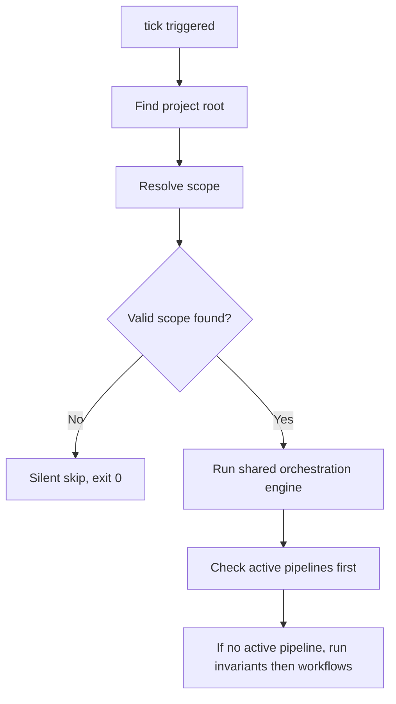

# Workspace Mechanism and Skill Distribution

This document describes the Argus workspace model and the rules for distributing skills across supported agents.

## 10. Workspace Mechanism

### 10.1 Positioning

A workspace is Argus’s **scope discovery mechanism**.

- **Purpose**: enable a shared orchestration engine for repositories that have not yet set up project-level Argus, and guide them toward initialization when a global invariant fails
- **Uniformity**: a workspace is no longer a special “bootstrap-only” layer. Once a scope is identified, global scope and project scope share the same orchestration semantics, state model, and context-injection logic
- **Principle**: “scopes change configuration, not orchestration semantics.” Workspaces provide different artifact roots to the same engine

### 10.2 `setup --workspace <path>`

This command registers a directory as an Argus workspace, usually a parent directory containing multiple repositories.

If the path is already registered, rerunning the command does not add a second registration. Instead, it refreshes the managed global hooks, global built-in skills, and global artifacts so they match the current Argus binary.

**Actions performed**:

1. Write `argus tick` to **global** hook configuration for supported agents
2. Set up the current managed global built-in skills: `argus-configure-invariant`, `argus-configure-workflow`, `argus-doctor`, `argus-intro`, `argus-runtime`, `argus-setup`, and `argus-teardown`
3. **Release global artifacts**: release workspace-specific invariants such as `argus-project-setup` into `~/.config/argus/invariants/`, and create the global directory structure (`invariants/`, `workflows/`, `pipelines/`, `logs/`, and so on). The `workflows/` directory is created but no workflows are released into it. Project-only invariants such as `argus-project-init` are not released into global scope because their remediation workflows do not exist there
4. Record the workspace path in `~/.config/argus/config.yaml`

Multiple workspace registrations are supported.

#### Path Normalization Algorithm

CLI input to `argus setup --workspace <path>` may be absolute, relative, or start with `~`. Before storage, Argus normalizes it as follows:

1. **Resolve to an absolute path**: relative paths are resolved against the current working directory; `~` expands to `$HOME`
2. **Apply `filepath.Clean`**: remove `.`, `..`, duplicate separators, and trailing `/`
3. **Collapse `$HOME` back to `~`**: if the path is under the current user’s home directory, replace that prefix with `~`
4. **Store in `config.yaml`**: for example `~/work/company`

#### Matching Rules

- **Runtime expansion**: when reading the config, expand `~` back to the current `$HOME`
- **“Inside workspace” test**: compare the expanded workspace path against the current project path using **path-segment prefix matching**
- **Deduplication**: identical normalized strings are duplicates
- **Nested workspaces**: allowed
- **Symlinks**: match on the stored path form; do not resolve symlinks for comparison

#### Path Validation

Before normalization, `setup --workspace <path>` validates that the expanded absolute path exists and is a directory.

#### Confirmation

Both `setup --workspace <path>` and `teardown --workspace <path>` require confirmation unless `--yes` is provided. This includes rerunning `setup --workspace <path>` for an already registered workspace, because refresh is still a mutating operation.

#### Success Output

Workspace setup and teardown return `changes` and `affected_paths` summaries.

#### Teardown

`argus teardown --workspace <path>` removes one workspace registration. When the last workspace is removed, Argus also removes global hooks, global skills, global artifacts, and the managed `~/.config/argus/` root.

#### Flag Meaning

`--global` identifies the **source** of a hook invocation as global configuration. It is an internal source marker for `tick`, and remains available for any future reserved `trap` invocation.

### 10.3 Scope Model and Arbitration

Argus uses an explicit scope model:

- **Project scope**: indicated by `.argus/` at the project root; configuration lives inside the repository
- **Global scope**: rooted at `~/.config/argus/`; activated when the current project is inside a registered workspace but does not have project-level Argus set up

#### Arbitration Rule

When a hook fires, Argus resolves scope using the following strategy:

1. **Project scope wins**: if `.argus/` exists, use project scope only. Global-scope invariants and workflows must not be loaded even if the project lives under a registered workspace
2. **Global scope fallback**: if the project is inside a registered workspace but does not have `.argus/`, use global scope and load global artifacts such as `argus-project-setup`
3. **No scope**: if neither condition applies, activate no scope and let `tick` exit quietly

### 10.3.1 Project Root Discovery

When `tick` fires from a nested subdirectory, Argus needs to determine the project root:

1. Walk upward from `cwd` looking for `.argus/`. If found, that directory is the project root
2. If `.argus/` is not found, walk upward looking for `.git/` as a fallback
3. If neither is found, treat the directory as outside an Argus-managed project. Project-local tick prints guidance and exits normally; **global tick skips silently** with exit 0 and no output

#### Git Repository Requirement

`argus setup` requires the current directory to be inside a Git repository.

#### Subdirectory Setup Protection

If the user runs `argus setup` from a non-root subdirectory of a Git repository, Argus checks whether an ancestor already contains `.argus/` or whether the current directory is the Git root. Depending on the situation, Argus either errors or asks for confirmation.

### 10.4 Runtime `tick` Behavior

Under the current scope model, `tick` now follows one unified path:

The shared engine still uses the same user-visible `tick` output families documented in [technical-tick.md](technical-tick.md). Scope only changes which artifact root feeds that routing.

#### Key Design Changes

1. **Shared engine**: global scope no longer uses a hardcoded bootstrap branch. It now runs real invariant checks and pipeline orchestration
2. **Bootstrap as artifact**: setup guidance is now modeled as a global invariant (`argus-project-setup`) with a `prompt` field. Project-level remediation workflows such as `argus-project-init` exist only in project scope
3. **State persistence**: pipeline state under global scope is stored under `~/.config/argus/pipelines/`, keyed by a hash of the project path

Because global scope intentionally ships no workflows by default, a workspace tick will normally do one of two things:

- surface the first failing global invariant, such as `argus-project-setup`
- return no output when no global invariant needs attention

When `argus-project-setup` fails, the injected guidance asks the agent to stop before answering the user's original task and to present the setup / explain / ignore choices, preferably through the agent's question tool or another structured-choice input tool when available.

### 10.5 Relationship to Project-Level Setup

Workspace support provides orchestration before a project has project-level Argus set up, but canonical project setup still happens through `argus setup`. Once project-level Argus is set up, the repository stops being governed by global scope and becomes fully project-driven.

---

## 11. Skill Distribution

### 11.1 Agent Skills Standard

Argus uses the [Agent Skills](https://agentskills.io) standard for skill definition and distribution.

- **Standard layout**: `<name>/SKILL.md` containing frontmatter and Markdown instructions
- **Project-level discovery paths**:
  - Codex scans `.agents/skills/<name>/SKILL.md`
  - Claude Code scans `.claude/skills/<name>/SKILL.md`
  - OpenCode scans `.opencode/skills/<name>/SKILL.md`, `.claude/skills/<name>/SKILL.md`, and `.agents/skills/<name>/SKILL.md` in that order, keeping only the first matching copy of a given skill name
- **Setup choice**: project-level setup writes the project-scope skill subset to `.agents/skills/` and mirrors it into `.claude/skills/`. Argus intentionally does not create `.opencode/skills/` at project scope because OpenCode already supports compatible discovery. Both `argus setup` and `argus setup --workspace` refresh the managed global skills in agent-specific global skill directories, still using the Agent Skills format

### 11.1.1 Rejected Alternatives

- **Plugin-based skills** (Claude Code plugin or Codex plugin): the plugin systems are not cross-agent compatible and would cost more to maintain
- **MCP-tool-only approach**: MCP tools are not skills and cannot be invoked the same way, for example through `/argus-xxx`

### 11.2 Built-In Skills

Argus provides built-in skills in several categories.

#### Standalone skills (usable even if the Argus binary is unavailable)

- `argus-intro`: explain what Argus is, why bootstrap reminders appear, and what setup changes
- `argus-setup`: project setup, project initialization, and version-upgrade guidance
- `argus-teardown`: teardown of hooks, cleanup of configuration, and binary cleanup guidance
- `argus-doctor`: diagnostics and troubleshooting

#### Binary-dependent runtime skill

- `argus-runtime`: query current pipeline state, manage workflows, and run invariant operations

#### Knowledge/reference skills

- `argus-configure-invariant`: detailed reference for invariant YAML authoring with validation and safe-write flow
- `argus-configure-workflow`: detailed reference for workflow YAML authoring with validation and safe-write flow

### 11.3 Skill Naming Rules

To keep invocation stable across agents, all skills follow these rules:

- lowercase letters, digits, and hyphens only
- maximum length 64
- regex: `^[a-z0-9]+(-[a-z0-9]+)*$`
- no colon (`:`)
- the directory name must match the `name` field in `SKILL.md`
- the `argus-` prefix is reserved for built-ins

Invocation examples:

- Claude Code: `/argus-doctor`
- Codex: `$argus-doctor` or `/use argus-doctor`
- OpenCode: through the `skill` tool; skills are not automatically slash commands

### 11.4 Skill Version Management

Skills are tightly coupled to project configuration.

- `SKILL.md` files are generated by `argus setup` from templates embedded in the Argus binary
- generated project skill files are meant to be committed to Git
- after upgrading the Argus binary, rerun `argus setup` to refresh the checked-in project skills, prune obsolete built-in project skill directories, and refresh the managed global skills

### 11.5 Global and Project-Level Paths

#### Project-Level Paths

- **Skills**: `.agents/skills/argus-*/SKILL.md`, `.claude/skills/argus-*/SKILL.md`
- **Hooks**: project-specific agent config files such as `.claude/settings.json`, `.codex/hooks.json`, `.opencode/plugins/argus.ts`

#### Global Paths (written by `argus setup` and `setup --workspace`)

**Hook configuration**

| Agent | Global hook path |
|------|------------------|
| Claude Code | `~/.claude/settings.json` |
| Codex | `~/.codex/hooks.json` |
| OpenCode | `~/.config/opencode/plugins/argus.ts` |

**Skill directories**

| Agent | Global skill path |
|------|-------------------|
| Claude Code | `~/.claude/skills/argus-*/` |
| Codex | `~/.agents/skills/argus-*/` |
| OpenCode | `~/.config/opencode/skills/argus-*/` |

Global scope currently distributes these managed built-in skills: `argus-configure-invariant`, `argus-configure-workflow`, `argus-doctor`, `argus-intro`, `argus-runtime`, `argus-setup`, and `argus-teardown`.

**OpenCode compatibility note**: in addition to its native `~/.config/opencode/skills/`, OpenCode also scans `~/.claude/skills/` and `~/.agents/skills/`.

#### Coexistence Strategy

When project-level and global skills coexist, each agent discovers and loads them according to its own search order. For OpenCode, duplicate names follow first-found-wins behavior.
