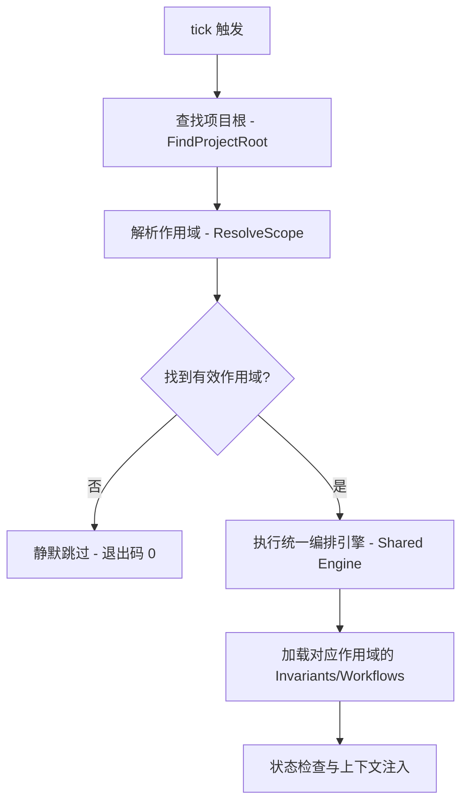

# 工作区机制与 Skill 分发

本文档详细描述 Argus 的工作区（Workspace）机制以及 Skill 的分发与安装标准。

## 10. 工作区机制

### 10.1 定位

工作区（Workspace）是 Argus 的**作用域发现机制**（Scope Discovery Mechanism）。

*   **目的**：为尚未安装项目级 Argus 的项目启用共享的编排引擎，并引导其进行初始化。
*   **统一性**：工作区不再是一个"纯引导层"。一旦作用域被识别，全局作用域与项目作用域共享相同的编排语义、状态管理和上下文注入逻辑。
*   **原则**：遵循 "Scopes change configuration, not orchestration semantics"。工作区通过识别当前环境所属的作用域，为编排引擎提供不同的配置根（Artifact Roots）。

### 10.2 install --workspace <path>

该命令用于将一个目录注册为 Argus 工作区，通常用于包含多个项目的父目录。

*   **执行操作**：
    1.  将 `argus tick` 和 `argus trap` 写入各 Agent 的**全局** Hook 配置文件。
    2.  安装全局 Skills（如 `argus-install`、`argus-doctor` 等）。
    3.  **释放全局 Artifacts**：将全局特定的 Invariant（`argus-project-init`）释放到全局配置目录 `~/.config/argus/invariants/`，并创建全局目录结构（`invariants/`, `workflows/`, `pipelines/`, `logs/` 等子目录）。注意：Workflows 目录被创建但不释放任何 Workflows；项目级 Invariants（如 `argus-init`）不被释放到全局作用域，因为它们的修复工作流不存在于全局作用域。
    4.  将工作区路径记录到用户级配置文件 `~/.config/argus/config.yaml`。
*   **多工作区支持**：支持注册多个工作区路径。

**路径规范化算法**：

CLI 输入（`argus install --workspace <path>`）接受任意形式的路径（绝对、相对、`~` 开头均可）。存储前按以下步骤规范化：

1. **解析为绝对路径**：相对路径基于 CWD 解析；`~` 展开为 `$HOME`
2. **`filepath.Clean`**：消除 `.`/`..`/重复分隔符，去掉尾部 `/`
3. **压缩 `$HOME` 为 `~`**：若路径以当前用户的 `$HOME` 为前缀，将该前缀替换为 `~`
4. **存入 config.yaml**：最终存储形式如 `~/work/company`

**匹配规则**：

- **运行时展开**：从 config.yaml 读取路径后，将 `~` 展开为当前 `$HOME`，得到绝对路径
- **"位于 workspace 内"判断**：展开后的 workspace 绝对路径与当前项目路径做**路径分段前缀匹配**。
- **去重**：规范化后的字符串完全相等即为重复。
- **嵌套 workspace**：允许。
- **symlink**：按存储的原始路径进行匹配，不解析 symlink。

**路径校验**：`install --workspace <path>` 在规范化之前，先检查 `<path>` 展开后的绝对路径是否存在且为目录。

**确认机制**：`install --workspace <path>` 与 `uninstall --workspace <path>` 都需要二次确认；传入 `--yes` 跳过。

**成功输出**：workspace install / uninstall 成功时，返回 `changes` 和 `affected_paths` 摘要。

*   **卸载**：执行 `argus uninstall --workspace <path>` 可移除特定工作区。当所有工作区都被移除时，系统会自动清理全局 Hook 和全局 Skills。
*   **标志位变更**：`--global` 描述 Hook 的**来源**（全局配置），作为 `tick` / `trap` 的内部来源标记。

### 10.3 作用域模型与仲裁 (Scope Model and Arbitration)

Argus 引入了显式的作用域模型来处理不同层次的配置：

*   **项目作用域 (Project Scope)**：由项目根目录下的 `.argus/` 标识，配置存储在项目内。
*   **全局作用域 (Global Scope)**：由 `~/.config/argus/` 标识，当项目位于注册的工作区内且未安装项目级 Argus 时激活。

**仲裁规则 (Arbitration Rule)**：

当一个 Hook 触发时，Argus 按以下逻辑进行作用域决策（Strategy 1）：
1. **项目作用域优先**：如果当前项目已安装项目级 Argus（存在 `.argus/`），则**完全采用项目作用域**。即使该项目位于某个注册的工作区内，全局作用域的 Invariants 和 Workflows 也不会被加载。
2. **全局作用域回退**：如果当前项目未安装项目级 Argus，但位于已注册的工作区内，则采用**全局作用域**。此时编排引擎会加载全局 Artifacts（如 `argus-project-init` 不变量）。
3. **无作用域**：若两者均不满足，则不激活任何作用域，`tick` 静默退出。

### 10.3.1 项目根发现规则

当 tick 从嵌套子目录触发时，argus 需要定位项目根目录：

1. **从 CWD 向上查找 `.argus/` 目录**，找到即为项目根。
2. **找不到 `.argus/`** → 向上查找 `.git/` 目录作为 fallback。
3. **都找不到** → 视为非 Argus 项目。项目级 tick 输出提示信息后正常退出；**global tick 静默跳过**（exit 0，无输出）。

#### Git 仓库要求

`argus install` 要求当前目录位于某个 Git 仓库内。

#### 子目录 install 保护

如果用户在 git repo 的非根目录执行 `argus install`，Argus 会检测祖先目录是否已有 `.argus/` 或当前是否在 git root，并根据情况报错或要求确认。

### 10.4 运行时 tick 行为

在新的作用域模型下，`tick` 行为实现了全路径统一：

**关键设计变更**：

1. **共享引擎**：全局作用域不再使用硬编码的引导分支，而是运行真实的 Invariant 检查和 Pipeline 编排。
2. **引导即 Artifact**：原来的"引导安装"逻辑现在由全局不变量（如 `argus-project-init`）和修复工作流（如 `argus-init`）实现。
3. **状态持久化**：全局作用域下的 Pipeline 状态存储在全局路径 `~/.config/argus/pipelines/` 下，并以项目路径的哈希作为标识。

### 10.5 与项目级 install 的关系

工作区提供了在项目尚未初始化时的编排能力，但正式的项目化配置始终由 `argus install` 完成。一旦项目级 Argus 安装完成，项目将脱离全局作用域的管辖，转由项目自身的 Artifacts 驱动。

---

## 11. Skill 分发

### 11.1 Agent Skills 标准

Argus 采用 [Agent Skills](https://agentskills.io) 开放标准进行 Skill 的定义与分发。

*   **标准格式**：`<name>/SKILL.md`，包含 YAML frontmatter 和 Markdown 指令。
*   **项目级发现路径**：Codex 扫描 `.agents/skills/<name>/SKILL.md`；Claude Code 扫描 `.claude/skills/<name>/SKILL.md`。OpenCode 按顺序扫描 `.opencode/skills/<name>/SKILL.md`、`.claude/skills/<name>/SKILL.md`、`.agents/skills/<name>/SKILL.md`；同名 Skill 仅保留首次发现的副本。
*   **决策**：项目级安装（`argus install`）将 Skill 写入项目根目录的 `.agents/skills/`，并同步镜像到 `.claude/skills/`。Argus 不额外生成 `.opencode/skills/`，因为 OpenCode 已可通过兼容路径发现这些 Skill。全局安装（`argus install --workspace`）将 Skill 写入各 Agent 的全局 Skill 目录（见 §11.5 全局安装路径表）。这些路径均遵循 Agent Skills 标准格式。

### 11.1.1 排除的方案

*   **Plugin 方案**（Claude Code Plugin / Codex Plugin）：各 Agent 的 Plugin 体系不互通，维护成本高。
*   **MCP 工具方案**：MCP 工具不是 Skill，用户无法通过 `/argus-xxx` 调用。

### 11.2 内置 Skills 清单

Argus 提供一系列内置 Skill，分为独立型、依赖型和参考型。

#### 独立型（不依赖 Argus 二进制，故障时可用）
*   **argus-install**：涵盖全新安装、项目初始化配置及版本升级。
*   **argus-uninstall**：引导卸载过程，包括移除 Hook、清理配置及二进制。
*   **argus-doctor**：诊断排错工具。

#### 依赖型（需要 Argus 二进制环境）
*   **argus-status**：查询当前 Pipeline 或 Job 的运行进度与详细状态。
*   **argus-workflow**：启动或管理特定的 Workflow。
*   **argus-invariant-check**：手动触发 Invariant 检查并查看结果。

#### 任务配套型（在执行 Job 时加载）
*   **argus-generate-rules**：指导 Agent 为各 Agent 的原生 Rules 系统生成规范内容。

#### 知识参考型（作为 Agent 的背景知识）
*   **argus-concepts**：介绍 Argus 的术语、核心架构与基本概念。
*   **argus-workflow-syntax**：提供 Workflow YAML 语法的详细参考文档。

### 11.3 Skill 命名规范

为确保跨 Agent 的稳定调用，所有 Skill 遵循以下规范：

*   **字符限制**：仅限小写字母、数字和连字符（`-`）。
*   **长度限制**：最长 64 个字符。
*   **正则校验**：`^[a-z0-9]+(-[a-z0-9]+)*$`。
*   **特殊限制**：严禁使用冒号（`:`）。
*   **目录一致性**：Skill 所在的目录名必须与 `SKILL.md` 中的 `name` 字段严格一致。
*   **命名空间**：`argus-` 前缀由官方保留，用于内置 Skill。
*   **调用方式**：
    *   Claude Code: `/argus-doctor`
    *   Codex: `$argus-doctor`，或 `/use argus-doctor`
    *   OpenCode: 通过 `skill` 工具调用；Skill 不会自动变成 slash command

### 11.4 Skill 版本管理

Skill 的生命周期与项目配置紧密相关：

*   **生成机制**：`SKILL.md` 文件由 `argus install` 自动生成，其模板内容内嵌于 Argus 二进制中。
*   **团队共享**：生成的 Skill 文件应提交至 Git 仓库。
*   **更新路径**：在升级 Argus 二进制后，重新执行 `argus install` 即可更新项目中的 Skill 文件。

### 11.5 全局与项目级路径

#### 项目级路径
- **Skill**：`.agents/skills/argus-*/SKILL.md`、`.claude/skills/argus-*/SKILL.md`
- **Hook**：各 Agent 项目级配置文件（如 `.claude/settings.json`、`.codex/hooks.json`、`.opencode/plugins/argus.ts`）

#### 全局路径（由 `install --workspace` 写入）

**Hook 配置：**

| Agent | 全局 Hook 路径 |
|-------|---------------|
| Claude Code | `~/.claude/settings.json` |
| Codex | `~/.codex/hooks.json` |
| OpenCode | `~/.config/opencode/plugins/argus.ts` |

**Skill 目录：**

| Agent | 全局 Skill 路径 |
|-------|----------------|
| Claude Code | `~/.claude/skills/argus-*/` |
| Codex | `~/.agents/skills/argus-*/` |
| OpenCode | `~/.config/opencode/skills/argus-*/` |

**OpenCode 兼容说明**：除原生的 `~/.config/opencode/skills/` 外，OpenCode 还会兼容扫描 `~/.claude/skills/` 与 `~/.agents/skills/`。

#### 共存策略
项目级与全局 Skill 共存时，Agent 会按各自支持的路径自动识别并加载。OpenCode 在扫描路径里遇到同名 Skill 时采用 first-found-wins。
