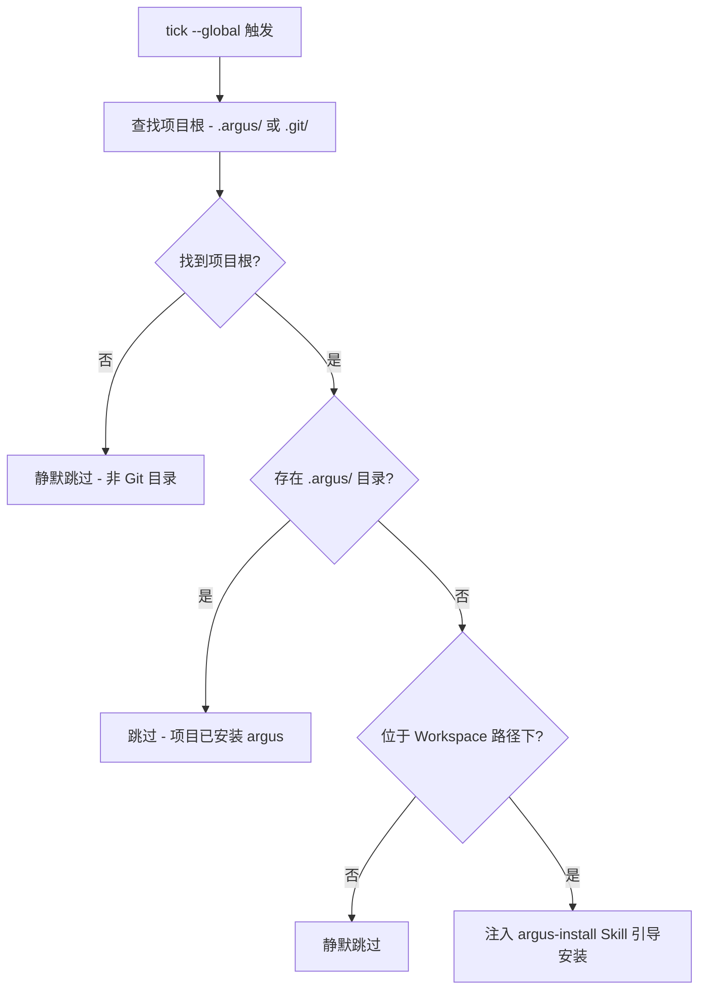

# 工作区机制与 Skill 分发

本文档详细描述 Argus 的工作区（Workspace）机制以及 Skill 的分发与安装标准。

## 10. 工作区机制

### 10.1 定位

工作区（Workspace）不是项目级 Argus 的替代品，而是一个**发现层**。

*   **目的**：引导项目安装项目级别的 Argus 及其相关配置。
*   **非侵入性**：工作区本身不直接执行项目初始化。
*   **原则**：确保"一人安装，全员受益"的原则在项目级得以维持，同时在个人开发环境提供跨项目的引导能力。

### 10.2 install --workspace <path>

该命令用于将一个目录注册为 Argus 工作区，通常用于包含多个项目的父目录。

*   **执行操作**：
    1.  将 `argus tick` 和 `argus trap` 写入各 Agent 的**全局** Hook 配置文件。
    2.  安装全局 Skills（如 `argus-install`、`argus-doctor` 等不依赖项目 `.argus/` 目录的工具型 Skill）。
    3.  将工作区路径记录到用户级配置文件 `~/.config/argus/config.yaml`。
*   **多工作区支持**：支持注册多个工作区路径，配置示例如下：

```yaml
# ~/.config/argus/config.yaml
workspaces:
  - ~/work/company
  - ~/work/client-x
```

**路径规范化算法**：

CLI 输入（`argus install --workspace <path>`）接受任意形式的路径（绝对、相对、`~` 开头均可）。存储前按以下步骤规范化：

1. **解析为绝对路径**：相对路径基于 CWD 解析；`~` 展开为 `$HOME`
2. **`filepath.Clean`**：消除 `.`/`..`/重复分隔符，去掉尾部 `/`
3. **压缩 `$HOME` 为 `~`**：若路径以当前用户的 `$HOME` 为前缀，将该前缀替换为 `~`
4. **存入 config.yaml**：最终存储形式如 `~/work/company`

示例：

| 用户输入 | CWD | 规范化结果 |
|---------|-----|-----------|
| `.` | `/Users/kai/work/company` | `~/work/company` |
| `~/work/company/` | — | `~/work/company` |
| `/Users/kai/work/company` | — | `~/work/company` |
| `../company` | `/Users/kai/work/client` | `~/work/company` |

**匹配规则**：

- **运行时展开**：从 config.yaml 读取路径后，将 `~` 展开为当前 `$HOME`，得到绝对路径
- **"位于 workspace 内"判断**：展开后的 workspace 绝对路径与当前项目路径做**路径分段前缀匹配**（即按 `/` 分割后逐段比较，避免 `/work/co` 误匹配 `/work/company`）
- **去重**：规范化后的字符串完全相等即为重复。重复注册时 stderr 输出提示但不视为错误
- **嵌套 workspace**：允许（如 `~/work/` 和 `~/work/client-x/` 同时注册），不做特殊处理。workspace 目前仅用于判断"是否在 workspace 内"
- **symlink**：按存储的原始路径进行匹配，不解析 symlink

**设计取舍**：存储时将 `$HOME` 压缩为 `~`，而非存储展开后的绝对路径。这使得 config.yaml 在用户名不同的机器间（如个人电脑与公司电脑）仍可复用。

**路径校验**：`install --workspace <path>` 在规范化之前，先检查 `<path>` 展开后的绝对路径是否存在且为目录。若路径不存在或不是目录，返回 exit 1 并提示错误信息。

*   **卸载**：执行 `argus uninstall --workspace <path>` 可移除特定工作区。卸载时对 `<path>` 应用**与 install 相同的规范化算法**，用规范化后的字符串与 config.yaml 中的已注册路径匹配。若未找到匹配项，返回 exit 1 并提示 workspace 不存在。当所有工作区都被移除时，系统会自动清理全局 Hook 和全局 Skills。
*   **标志位变更**：原有的 `--global` 作为安装入口的用法已被 `--workspace` 替代。`--global` 标志本身仍保留，作为 `tick` / `trap` 的内部来源标记（标识调用来自全局 Hook），由 `install --workspace` 自动写入全局 Hook 配置。

### 10.3 全局 Hook 去重

为了避免全局 Hook 与项目级 Hook 重复触发，系统引入了 `--global` 标志。该标志仅供内部使用，由 `install --workspace` 自动写入全局 Hook 配置。

*   **标志含义**：`--global` 描述 Hook 的**来源**（全局配置），而 `workspace` 描述**功能特性**。
*   **行为逻辑**：

| Hook 调用包含 --global | 行为描述 |
| :--- | :--- |
| **否** | 视为项目级调用，直接执行。 |
| **是** | 1. 检查当前项目是否存在 `.argus/` 目录？若是，则视为已安装项目级 Argus，跳过全局 Hook（即使没有配置项目级 Hook）。<br>2. 检查当前项目是否位于已注册的工作区路径下？若不是，则静默跳过。<br>3. 若通过上述检查，则正常执行（注入 argus-install Skill 引导安装）。 |

用户通常不需要手动干预 `--global` 标志的使用。

### 10.3.1 项目根发现规则

当 tick 从嵌套子目录触发时，argus 需要定位项目根目录：

1. **从 CWD 向上查找 `.argus/` 目录**，找到即为项目根。
2. **找不到 `.argus/`** → 向上查找 `.git/` 目录作为 fallback。
3. **都找不到** → 视为非 argus 项目。项目级 tick 输出提示信息后正常退出（fail-open）；**global tick 静默跳过**（exit 0，无输出）。

优先查找 `.argus/` 而非 `.git/`，因为 `.argus/` 是 argus 的直接标识。`.git/` 作为 fallback 是为了支持 workspace 场景（全局 hook 触发时项目可能尚未 install argus）。非 Git 目录（如 workspace 内的临时文件夹）不具备安装条件，global tick 不应对其注入 argus-install 引导。

#### Git 仓库要求

`argus install` 要求当前目录位于某个 Git 仓库内。若 CWD 向上查找不到 `.git/` 目录，直接报错 exit 1，提示 `Argus requires a Git repository. Please run 'git init' first.`。理由：后续初始化依赖 `.gitignore`、Git hook 等 Git 语义，非 Git 目录下无法完成完整安装。

#### 子目录 install 保护

如果用户在 git repo 的非根目录执行 `argus install`：

1. **检测到祖先目录已有 `.argus/`** → 报错，提示已有 argus 安装，避免嵌套。exit 1。
2. **CWD 不是 git root 但在某个 git repo 内** → 输出警告并要求二次确认。警告内容包含：
   - 当前位置与 git root 位置
   - 子目录安装的适用场景（如 monorepo 子项目需要独立的 workflow 编排）
   - 可能的后果（hook 配置范围、与 git root 的关系）
3. **用户确认后** → 在 CWD 创建 `.argus/` 目录。
4. **用户拒绝** → 输出 `Installation cancelled.`，exit 1。

**确认机制**（CLI 通用约定，适用于 `install` 子目录确认、`uninstall` 删除确认等所有需要确认的场景）：

- **交互式确认**：通过 stdin prompt 提示 `Continue? [y/N]`（默认 No）
- **`--yes` flag**：传入 `--yes` 跳过确认，直接执行。用于脚本和自动化场景
- **非 TTY 检测**：当 stdin 不是 TTY 且未传 `--yes` 时，直接拒绝（exit 1），并提示 `use --yes to skip confirmation`
- **Agent 场景**：Agent 内通过 Slash Command 触发安装时，Skill 的 prompt 应指导 Agent 使用 `--yes` 参数（因为 Agent 环境通常无 TTY）

### 10.4 工作区项目中的 tick 行为

在受工作区管理的目录中，`tick` 命令的触发逻辑如下：



**设计决策（仅 Skill 引导，不启动 Pipeline）**：

全局 tick 检测到未初始化项目时，**不启动真正的 Pipeline**，也不执行全局 Invariant 检查。仅通过注入 `argus-install` Skill 的 prompt 引导 Agent 执行 `argus install --yes`。因此 `install --workspace` **不释出全局 Invariant/Workflow 文件**，只安装全局 Hook 和全局 Skills。

这一设计简化了 Workspace 的实现：无需定义全局 Invariant/Workflow 的 ID 和内容，无需在未初始化项目中创建 `.argus/` 目录的副作用，保持了 Workspace 的纯引导层定位。

*   **自动创建**：项目级 Workflow 启动时，若缺失 `.argus/pipelines/` 目录，Argus 会自动创建以确保持久化正常。

### 10.5 与项目级 install 的关系

工作区仅提供发现和引导能力，实际的项目初始化始终由项目根目录下的 `argus install` 完成。

*   **结果一致性**：无论是否通过工作区引导，`argus install` 的初始化结果完全一致。
*   **团队协作**：项目级的配置（`.argus/`）应提交至 Git 仓库，确保团队成员共享相同的 Workflow 和 Rules 编排，即使他们没有配置个人工作区。

## 11. Skill 分发

### 11.1 Agent Skills 标准

Argus 采用 [Agent Skills](https://agentskills.io) 开放标准进行 Skill 的定义与分发。

*   **标准格式**：`<name>/SKILL.md`，包含 YAML frontmatter 和 Markdown 指令。
*   **共享发现路径**：`.agents/skills/<name>/SKILL.md`。这是 Claude Code、OpenCode 和 Codex 三个 Agent 共同支持的唯一路径。
*   **决策**：项目级安装（`argus install`）将 Skill 写入项目根目录的 `.agents/skills/`；全局安装（`argus install --workspace`）将 Skill 写入各 Agent 的全局 Skill 目录（见 §11.5 全局安装路径表）。两种路径均遵循 Agent Skills 标准格式。

### 11.1.1 排除的方案

*   **Plugin 方案**（Claude Code Plugin / Codex Plugin）：各 Agent 的 Plugin 体系不互通，需要为每个 Agent 维护一套，维护成本高。
*   **MCP 工具方案**：MCP 工具不是 Skill，用户无法通过 `/argus-xxx` 调用。Skill 的核心价值是用户可以通过斜杠命令主动触发，MCP 不满足这一需求。

### 11.2 内置 Skills 清单

Argus 提供一系列内置 Skill，分为独立型、依赖型和参考型。

#### 独立型（不依赖 Argus 二进制，故障时可用）
*   **argus-install**：涵盖全新安装、项目初始化配置及版本升级。
*   **argus-uninstall**：引导卸载过程，包括移除 Hook、清理配置及二进制。
*   **argus-doctor**：诊断排错工具。在 Argus 二进制不可用时，通过纯文件读取和基础 Shell 命令进行诊断。

#### 依赖型（需要 Argus 二进制环境）
*   **argus-status**：查询当前 Pipeline 或 Job 的运行进度与详细状态。
*   **argus-workflow**：启动或管理特定的 Workflow。
*   **argus-invariant-check**：手动触发 Invariant 检查并查看结果。

#### 任务配套型（在执行 Job 时加载）
*   **argus-generate-rules**：指导 Agent 为各 Agent 的原生 Rules 系统（如 Claude Code 的 `CLAUDE.md` 或 OpenCode 的 `AGENTS.md`）生成规范内容。

#### 知识参考型（作为 Agent 的背景知识）
*   **argus-concepts**：介绍 Argus 的术语、核心架构与基本概念。
*   **argus-workflow-syntax**：提供 Workflow YAML 语法的详细参考文档。

### 11.3 Skill 命名规范

为确保跨 Agent 的稳定调用，所有 Skill 遵循以下规范：

*   **字符限制**：仅限小写字母、数字和连字符（`-`）。
*   **长度限制**：最长 64 个字符。
*   **正则校验**：`^[a-z0-9]+(-[a-z0-9]+)*$`。
*   **特殊限制**：严禁使用冒号（`:`），因为冒号在 Claude Code 中被保留用于插件命名空间。
*   **目录一致性**：Skill 所在的目录名必须与 `SKILL.md` 中的 `name` 字段严格一致。
*   **命名空间**：`argus-` 前缀由官方保留，用于内置 Skill。
*   **调用方式**：
    *   Claude Code: `/argus-doctor`
    *   Codex: `$argus-doctor`
    *   OpenCode: 通过 `skill` 工具调用。

### 11.4 Skill 版本管理

Skill 的生命周期与项目配置紧密相关：

*   **生成机制**：`SKILL.md` 文件由 `argus install` 自动生成，其模板内容内嵌于 Argus 二进制中。
*   **团队共享**：生成的 Skill 文件应提交至 Git 仓库，确保所有团队成员（即使未安装 Argus）也能获得基本的引导（如安装提示）。
*   **更新路径**：在升级 Argus 二进制后，重新执行 `argus install` 即可更新项目中的 Skill 文件。

### 11.5 全局与项目级路径

#### 项目级路径
- **Skill**：`.agents/skills/argus-*/SKILL.md`（随代码库分发，团队共享）
- **Hook**：各 Agent 项目级配置文件（如 `.claude/settings.json`、`.codex/hooks.json`、`.opencode/plugins/argus.ts`）

#### 全局路径（由 `install --workspace` 写入）

**Hook 配置：**

| Agent | 全局 Hook 路径 |
|-------|---------------|
| Claude Code | `~/.claude/settings.json` |
| Codex | `~/.codex/hooks.json` |
| OpenCode | `~/.config/opencode/plugins/argus.ts` |

**Skill 目录：**

| Agent | 全局 Skill 路径 |
|-------|----------------|
| Claude Code | `~/.claude/skills/argus-*/` |
| Codex | `~/.agents/skills/argus-*/` |
| OpenCode | `~/.config/opencode/skills/argus-*/` |

#### 共存策略
项目级与全局 Skill 共存时不会产生冲突。由于内容一致，Agent 会自动识别并加载，确保在任何目录下 Argus 的基础工具都处于可用状态。
